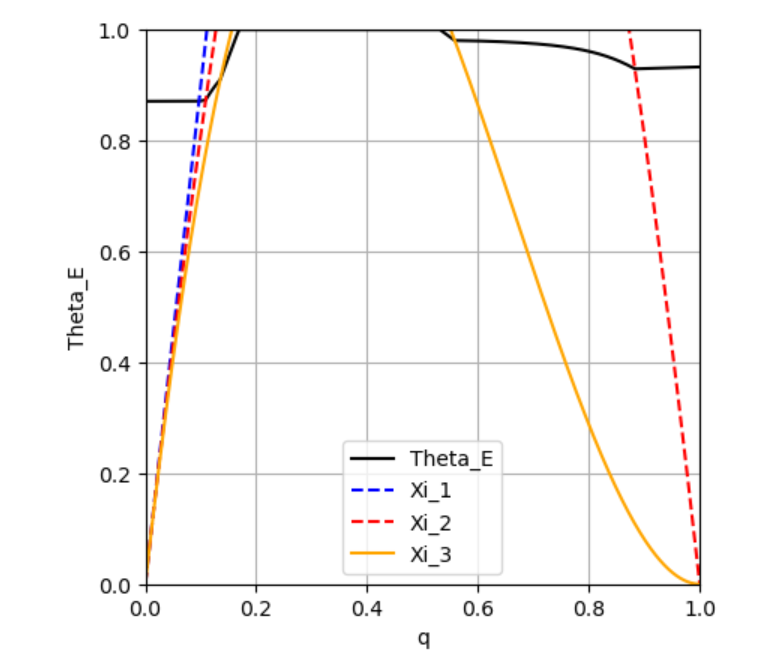

\newpage

# Quarto

Quarto lar deg kombinere tekst, kode og resultater i ett dokument. Det gjør analyser reproduserbare og enkle å oppdatere – endrer du data, oppdateres også figurene og resultatene automatisk.

Verktøyet støtter både R og Python, og passer derfor perfekt for samfunnsøkonomer som jobber med økonometriske analyser, databehandling eller maskinlæring.

Du kan lage profesjonelle rapporter, artikler og presentasjoner direkte fra samme fil – uten klipp og lim. Det gjør Quarto ideelt for studentprosjekter, bachelor- og masteroppgaver, og gir samtidig verdifull erfaring med arbeidsformer som brukes i forskning og analyseyrker.

For å lære mer om Quarto, se også <https://quarto.org>.

# YAML-header

Øverst i dokumentet ser du YAML hvor du kan spesifisere en del parametre for ditt dokument. Liste med YAML for pdf finner du [her](https://quarto.org/docs/reference/formats/pdf.html). `echo: false` er innstillingen for å utelate all kode fra dokumentet. Dette kan du overstyre dersom det er visse kodesnutter som du vil vise.

# Tekst og matte

Du kan skrive symboler og ligninger lekende lett med LaTeX-syntaks:

Vi ser på en **konsument** som kan *kjøpe* gode $x_1$ og $x_2$.

Konsumentens preferanser uttrykkes gjennom en nyttefunksjon:

$$
U(x_1,x_2)
$$ {#eq-nytte}

Konsumenten liker begge goder, dvs $\frac{\partial U}{\partial x_1}>0, \frac{\partial U}{\partial x_2}>0$

Vi ser at @eq-nytte viser nyttefunksjonen. Videre er @eq-nytte viktig.

Det finnes masse gode ressurser på nettet for hvordan man skriver ligninger i Quarto, f.eks. [her](https://qmd4sci.njtierney.com/math.html).

::: callout-tip
### Oppgave: Matte og kryssreferanse

1)  Endre etiketten `{#eq-nytte}` til `{#eq-utility}` og oppdater referansene i teksten (`@eq-utility`).\
2)  Legg til en kort setning med inline-matte, f.eks. `MRS = -\frac{dx_2}{dx_1}`, og render.
:::

# Kode

Velg "Executable cell-R" (ctrl+alt+I i Windows, cmd+option+I i Mac).

```{r}
```

```{r}
```

```{r}

```

```{r}
#| label: fig-indkurver        # Unik ID for chunken/figuren. Brukes til kryssreferanse: @fig-indkurver
#| fig-cap: "Indifferenskurver" # Bildetekst som vises under figuren og i figurliste 


rm(list = ls())


suppressPackageStartupMessages(library(tidyverse))


#lag aksen for tegningen

axes_1 <- ggplot()+
  labs(x=expression(x[1]), y=expression(x[2]))+
  theme(axis.title = element_text(size = 20),
        plot.title = element_text(size = 20),
        panel.background = element_blank(), # hvit bakgrunn
        axis.line = element_line(colour = "black"))+ # sett inn akselinjer
  coord_fixed(ratio = 1)+ # lik skala for x og y aksen
  scale_x_continuous(limits = c(0, 20), expand = c(0, 0))+
  scale_y_continuous(limits = c(0, 20), expand = c(0, 0)) # begrense aksene
# og sikre at akselinjene møttes i (0,0).

# vi angir noen indifferenskurver

I_0 <- function(x_1) (5^2)/x_1 # nyttenivå 5
I_1 <- function(x_1) (7^2)/x_1
I_2 <- function(x_1) (9^2)/x_1

figur_1 <- axes_1 + 
  stat_function(
        fun=I_0,
        mapping = aes()
        ) +
  stat_function(
                fun=I_1,
                mapping = aes()
  ) +
  stat_function(
                fun=I_2,
                mapping = aes()
  )+
  annotate("text",x=19,y=1, label=expression(u[0]))+
  annotate("text",x=19,y=3.3, label=expression(u[1]))+
  annotate("text",x=19,y=5.3, label=expression(u[2]))

figur_1
```

@fig-indkurver vises i den kompilerte pdf, men koden vises ikke.

\newpage

Jeg kan velge å vise koden ved å skrive `#| echo: true` øverst i snutten jeg vil vise

```{r}
#| label: fig-mrs
#| fig-cap: "Marginal substitusjonsbrøk"
#| echo: true
figur_2 <- axes_1+
  stat_function(
                fun=I_1,
                mapping = aes()
  )+
  annotate("text",x=19,y=3.3, label=expression(u[1]))+
  geom_segment(aes(x=0, y=17.9, xend=10.8, yend=0))+
  geom_segment(aes(x=5, y=0, xend=5, yend=9.8), linetype="dashed")+
  geom_segment(aes(x=0, y=9.8, xend=5, yend=9.8), linetype="dashed")
  

figur_2
```

@fig-mrs er vakker.

I @fig-budsjett tegner vi konsumentens budsjett.

```{r}
#| label: fig-budsjett
#| fig-cap: "Konsumentens budsjett"

buds_0 <- function(x_1) 18-1.5*x_1

figur_3 <- axes_1+
  labs(title="Konsumentens budsjett")+
  stat_function(
                fun=buds_0,
                mapping = aes()
  )+
  annotate("text",x=4.5,y=18, label=expression(m/p[2]))+
  geom_segment(aes(x=3, y=18, xend=.2, yend=18),
               arrow = arrow(length = unit(0.25, "cm")))+
  annotate("text",x=12,y=4., label=expression(m/p[1]))+
  geom_segment(aes(x=12, y=3, xend=12, yend=.2),
               arrow = arrow(length = unit(0.25, "cm")))

figur_3
```

Vi har tegnet konsumentens budsjett (se @fig-budsjett).

# Tabeller

```{r}
#| label: tbl-iris
#| tbl-cap: "Iris Data"

library(knitr)
kable(head(iris))

```

I @tbl-iris ser vi noe data.

Vi kan også lage en tabell ved hjelp av nedtrekksmenyen

| Navn  | Alder | Høyde |
|-------|-------|-------|
| Alfa  | 6     | 77    |
| Beta  | 5     | 85    |
| Gamma | 4     | 91    |

: Alder og høyde {#tbl-tall}

Se @tbl-tall.

::: callout-tip
### Oppgave: Lag en tabell i visuell editor

1.  Plasser markøren der du vil ha tabellen.\
2.  Velg **Insert → Table** i den visuelle editoren.\
3.  Legg inn minst tre kolonner og tre rader med egne data (f.eks. navn, alder, høyde).\
4.  Render dokumentet og sjekk hvordan tabellen ser ut i PDF-en.\
5.  Bonus: Legg til eller fjern en kolonne via **Table → Insert/delete column...** i menyen, og render igjen for å se forskjellen.
:::

# Bilder

@fig-bilde er satt inn ved hjelp av "Insert" funksjonen. Det kan være vanskelig å kontrollere hvor den plasseres i pdf-dokumentet, men legg merke til kommandoen i YAML `fig-pos = 'H'` skal tvinge bilder og figurer til å skrives ut hvor de kommer i teksten. Du kan også bruke en liten 'h' som betyr ca. her (her kan du redusere hvite deler av sider, men det kan flytte på figuren og sette den på en uønsket plass); 'ht' betyr her eller i toppen av neste side.

{#fig-bilde fig-align="center" width="600"}

::: callout-tip
### Oppgave: Sett inn bilde

1.  Lag en mappe **images/** i samme mappe som `.qmd`-fila.\
2.  Kopiér bildet ditt (f.eks. `figur1.png`) inn i **images/**.\
3.  I visuell editor: **Insert → Image** → velg `images/figur1.png`.\
4.  Legg til en bildetekst (caption), render, og sjekk at bildet vises.\
:::

# Flere artige funksjoner

## Sitering

I Quarto kan du sitere direkte fra Zotero-biblioteket ditt ved hjelp av den visuelle editoren. [**Zotero må være installert på datamaskinen din.**](https://uit.no/ub/skriveogreferere/referanseverktoy)

### Koble Zotero til RStudio

For at den visuelle editoren skal finne Zotero-biblioteket ditt:

1.  Velg **Tools → Global Options → R Markdown → Citations**

2.  Aktiver Zotero-integrasjon

Når du nå går inn på **Insert → Citation**, får du opp Zotero som mulighet og kan søke direkte i biblioteket ditt.

### Oppsett

Du trenger ikke legge til noe i YAML manuelt! Den visuelle editoren håndterer dette automatisk første gang du setter inn en sitering. Hvis du vil bruke en spesifikk referansestil (f.eks. APA), kan du legge til dette i YAML: `csl: https://www.zotero.org/styles/apa-7th-edition`

### Slik setter du inn siteringer

1.  Åpne dokumentet ditt i visuell modus

2.  Bruk menyen **Insert → Citation → From Zotero**

3.  Søk etter og velg kilden du vil sitere

4.  Klikk "Insert"

Første gang du gjør dette, vil editoren automatisk:

-   Opprette en `references.bib`-fil i prosjektmappen din

-   Legge til `bibliography: references.bib` i YAML

-   Sette inn siteringen i teksten din

Eksempel i teksten: @kahneman1979 er den mest siterte artikkelen innen samfunnsøkønomi gjennom tidene, mens @baker2016 har mest siteringer av samfunnsøkonomiske artikler siden 2010. Quarto lager automatisk en referanseliste på slutten av dokumentet, basert på kildene du har sitert [@akerlof1970;@andreasson2017].

## Fotnoter

Disse kan settes inn fra nedtrekksmenyen "Insert".[^1]

[^1]: Som på dette viset.

::: callout-tip
### Oppgave: Fotnote

Legg til en ny **fotnote** ved å bruke menyen i den visuelle editoren:\
1. Ha kursoren der du vil sette inn fotnoten. 2. Gå til **Insert → Footnote**.\
3. Skriv inn teksten som skal stå i fotnoten.\
4. Render dokumentet og sjekk at fotnoten vises nederst på siden og nummereres riktig.
:::

# Referanser
